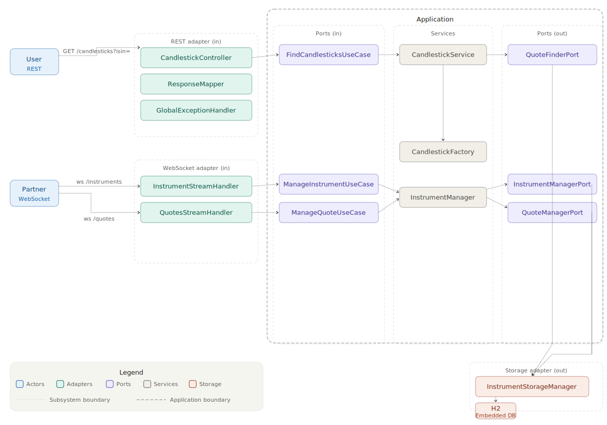

# Architecture

The service follows **Hexagonal Architecture** (Ports & Adapters). The application core defines use case interfaces (ports) that adapters implement or consume, keeping business logic free of infrastructure dependencies.

